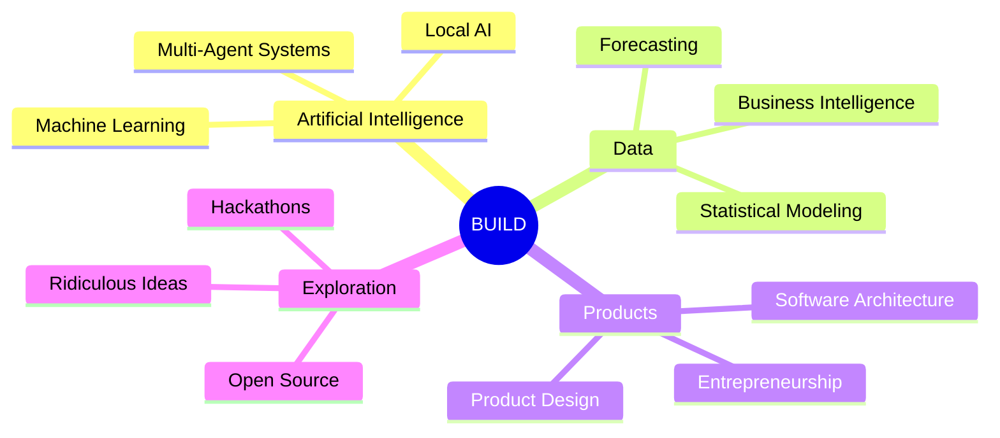

<!-- ═══════════════════════════════════════════════════════════════════════ -->
<!--                            HERO / HEADER                                 -->
<!-- ═══════════════════════════════════════════════════════════════════════ -->

<div align="center">


<a href="https://github.com/migueloip">
  
</a>

<br />

<!-- Animated live badges -->
<a href="https://github.com/migueloip?tab=followers"></a>
<a href="https://github.com/migueloip?tab=repositories"></a>


<br /><br />

<!-- Quick nav -->
<a href="#-whoami">whoami</a> &nbsp;•&nbsp;
<a href="#-current-missions">missions</a> &nbsp;•&nbsp;
<a href="#-toolbox">toolbox</a> &nbsp;•&nbsp;
<a href="#-git-stats">stats</a> &nbsp;•&nbsp;
<a href="#-connect">connect</a>

</div>

<!-- Animated divider -->


<!-- ═══════════════════════════════════════════════════════════════════════ -->
<!--                              WHOAMI                                       -->
<!-- ═══════════════════════════════════════════════════════════════════════ -->

## 🧬 `~/whoami`

```yaml
name:     Miguel Ángel Figueroa Muñoz
location: Chile 🇨🇱
role:     Computer Science Student & AI Product Builder

mission: "Build technology that feels like it arrived from the future."

currently:
  - Deploying AI Data Science Teams
  - Exploring collaborative multi-agent architectures
  - Turning real business problems into useful software

system:
  os:         Linux
  coffee:     Required
  hackathons: Always
  ambition:   Unreasonably high
```


<!-- ═══════════════════════════════════════════════════════════════════════ -->
<!--                          CURRENT MISSIONS                                -->
<!-- ═══════════════════════════════════════════════════════════════════════ -->

## 🚀 `./current-missions`

<table>
<tr>
<td width="50%" valign="top">

### 🧠 AI Forecast Studio

An **AI Executive Data Science Team** that analyzes business data, compares statistical and ML models, forecasts what comes next and turns results into executive decisions.


</td>
<td width="50%" valign="top">

### 📁 Middi

A **document intelligence & compliance platform** for companies managing workers, expirations, alerts and complex enterprise workflows.


</td>
</tr>
<tr>
<td width="50%" valign="top">

### 🌍 Geo Creator

**Procedural 3D city generation** from real-world maps, designed for urban simulation, experimentation and interactive environments.


</td>
<td width="50%" valign="top">

### 🤖 Multi-Agent Systems

Experiments in **autonomous AI collaboration**: specialized agents that reason, debate, delegate and solve larger problems as a coordinated team.


</td>
</tr>
</table>


<!-- ═══════════════════════════════════════════════════════════════════════ -->
<!--                              TOOLBOX                                      -->
<!-- ═══════════════════════════════════════════════════════════════════════ -->

## 🧰 `./toolbox --animated`

<div align="center">

**⚡ Languages & Frameworks**


<br /><br />

**🗄️ Data · Infra · Tools**


</div>


<!-- ═══════════════════════════════════════════════════════════════════════ -->
<!--                            FOCUS MINDMAP                                  -->
<!-- ═══════════════════════════════════════════════════════════════════════ -->

## 🎯 `./focus --now`




<!-- ═══════════════════════════════════════════════════════════════════════ -->
<!--                             GIT STATS                                     -->
<!-- ═══════════════════════════════════════════════════════════════════════ -->

## 📊 `git stats --global`

<div align="center">


<br />

<!-- Animated streak -->
<picture>
  <source media="(prefers-color-scheme: dark)" srcset="https://github-readme-streak-stats.herokuapp.com/?user=migueloip&hide_border=true&background=00000000&ring=00D9A3&fire=00B386&currStreakLabel=00D9A3&sideLabels=C9D1D9&dates=8B949E&currStreakNum=FFFFFF&sideNums=FFFFFF" />
  
</picture>

<br /><br />

<!-- Trophies -->


<br />

<!-- Animated contribution snake — generated by GitHub Action (see below) -->
<picture>
  <source media="(prefers-color-scheme: dark)" srcset="https://raw.githubusercontent.com/migueloip/migueloip/output/snake-dark.svg" />
  <source media="(prefers-color-scheme: light)" srcset="https://raw.githubusercontent.com/migueloip/migueloip/output/snake.svg" />
  
</picture>

<br /><br />

<!-- Activity graph -->
<picture>
  <source media="(prefers-color-scheme: dark)" srcset="https://github-readme-activity-graph.vercel.app/graph?username=migueloip&bg_color=00000000&color=8B949E&line=00D9A3&point=FFFFFF&area=true&area_color=00B386&hide_border=true" />
  
</picture>

</div>


<!-- ═══════════════════════════════════════════════════════════════════════ -->
<!--                            PRINCIPLES                                     -->
<!-- ═══════════════════════════════════════════════════════════════════════ -->

## 📜 `cat principles.md`

```text
01  Build first. Learn aggressively. Improve continuously.
02  Make complex technology feel simple.
03  AI should augment people — not erase them.
04  A weekend is enough time to attempt something unreasonable.
05  Ambition becomes valuable when you ship.
```


<!-- ═══════════════════════════════════════════════════════════════════════ -->
<!--                              ROADMAP                                      -->
<!-- ═══════════════════════════════════════════════════════════════════════ -->

## 🗺️ `./roadmap --next`

- [ ] Build real products while studying
- [ ] Deploy a multi-agent AI team
- [ ] Win an international hackathon
- [ ] Contribute meaningfully to open source
- [ ] Launch my first software company
- [ ] Build something everyone says is impossible


<!-- ═══════════════════════════════════════════════════════════════════════ -->
<!--                              CONNECT                                      -->
<!-- ═══════════════════════════════════════════════════════════════════════ -->

## 🔗 `./connect`

<div align="center">

<a href="mailto:anguelmiguel640@gmail.com"></a>
<a href="https://github.com/migueloip"></a>
<!-- 👉 Añade tus redes reales aquí:
<a href="https://linkedin.com/in/USUARIO"></a>
<a href="https://x.com/USUARIO"></a>
-->

</div>


<!-- ═══════════════════════════════════════════════════════════════════════ -->
<!--                          SUDO MAKE FUTURE                                 -->
<!-- ═══════════════════════════════════════════════════════════════════════ -->

## 🌌 `sudo make future`

<div align="center">

**Build stupidly ambitious things. Then make them work.**


<br /><br />


</div>
